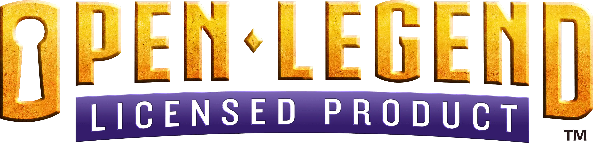

# Open Legend DE
*English below*
## Deutsch
Deutsche Übersetzung des Regelwerks für das open-source Rollenspielsystem Open Legend.

[Los geht's hier!](./src/Kapitel-0_Einfuehrung.md)
### Stand der Regeln
Alle Kapitel und Listen des Regelwerkes sind vollständig übersetzt. Die meisten Übersetzungen sind finalisiert. Bei manchen Begriffen wurde keine vollständig befriedigende Übersetzung gefunden. Anmerkungen, Hinweise auf Fehler und Änderungsvorschläge sind weiterhin willkommen.

### Die Regeln lesen
Am einfachsten sind die Regeln digital direkt hier auf GitHub zu lesen. Navigieren Sie einfach in den Ordner `src` und fangen Sie im Inhaltsverzeichnis oder mit der Einführung an.

Die Listen sind als `.yml` und als `.md`-Dateien verfügbar. Lesbarer sind die Markdown-Dateien.

## English
German translation of the rules of the open-source TTRPG system Open Legend.

[Start reading here!](./src/Kapitel-0_Einfuehrung.md)
### State of the rules
All chapters and listings of the rules have been fully translated. Most of the translations are finalized. A perfect translation has not been found for every single word though. Thoughts, notice of any errors or suggestions for changes continue to be appreciated.

### Reading the rules
Easiest is to read the rules digitally directly on GitHub. Navigate to the folder `src` and start reading at the Table-of-Contents or the Introduction.

The listings are present as `.yml` and `.md` files. Easier to read are the markdown files.

## License Notice
License Notice of the Open Legend Community Notice:  
*This product was created under the Open Legend Community License and contains material that is copyright to Seventh Sphere Entertainment. Such use of Seventh Sphere Entertainment materials in this product is in accordance with the Open Legend Community License and shall not be construed as a challenge to the intellectual property rights reserved by Seventh Sphere Entertainment. Seventh Sphere Entertainment and Open Legend RPG and their respective logos are trademarks of Seventh Sphere Entertainment in the U.S.A. and other countries.*
  
*The full-text Open Legend Community License can be found at  [http://openlegendrpg.com/community-license](http://openlegendrpg.com/community-license).*